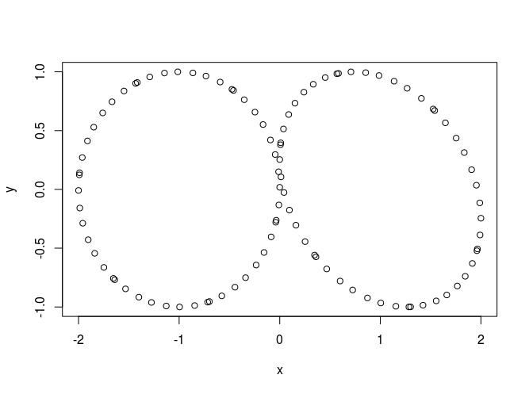
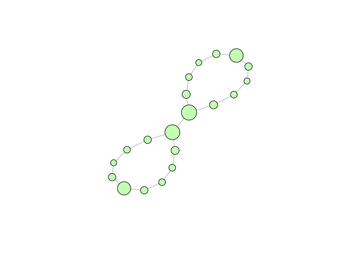

# mapperKD
An implementation of the mapper algorithm, as described in: *G. Singh, F. Memoli, G. Carlsson (2007). Topological Methods for the Analysis of High Dimensional Data Sets and 3D Object Recognition, Point Based Graphics 2007, Prague, September 2007.*

This implementation lets the user use:
* A filter of any dimension.
* Custom clustering algorithm.

## Instalation

To intall simply excecute:

```{r }
# If you don't have devtools
# install.packages("devtools")
library(devtools)
install_github("minigonche/mapperKD")
```
## Examples

```{r }
library('mapperKD')

# Example
# ----------------
# Construct the data set
data_points = data.frame( x=c(cos(1:50) - 1, cos(1:50) + 1), y=sin(1:100) )
plot(data_points)
```



```{r }
# Excecutes mapper
one_squeleton_result = mapperKD(k = 1,
                                distance = as.matrix(dist(data_points)),
                                filter = data_points$x,
                                intervals = c(12),
                                overlap = c(50),
                                clustering_method = hierarchical_clustering,
                                local_distance = FALSE,
                                data = NA)
# Visualize the result
g = convert_to_graph(one_squeleton_result)
V(g)$size = sqrt(get_1_esqueleton_node_sizes(one_squeleton_result)*30)
plot(g)
```

