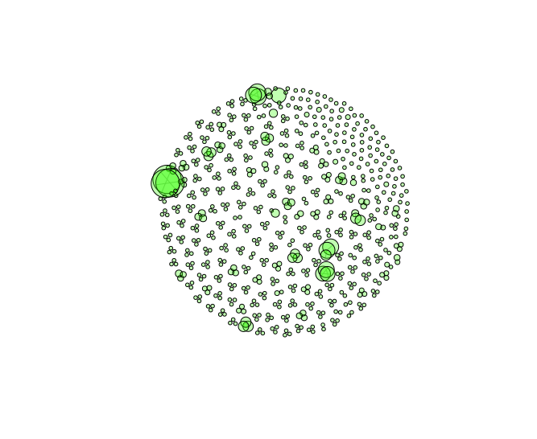
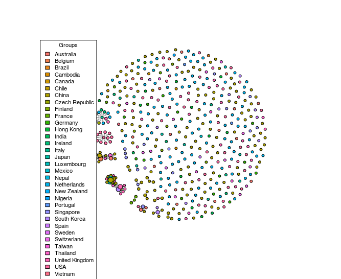
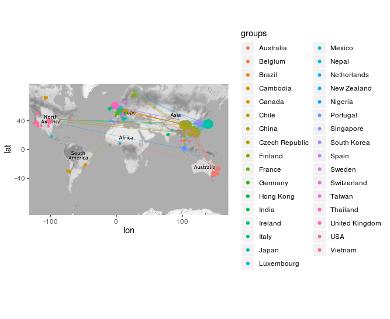
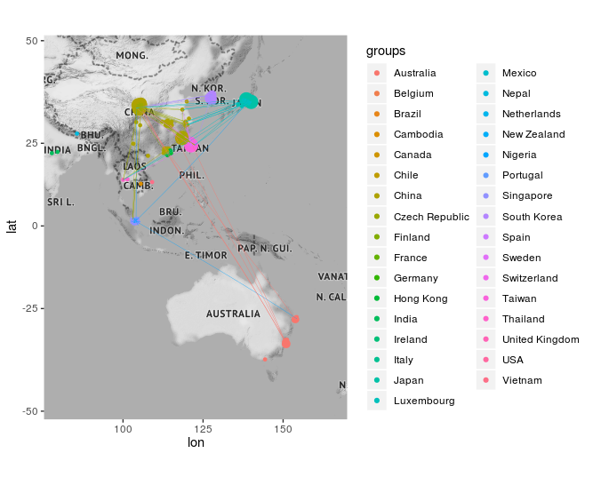

# Example 2: SARS-CoV-2

The following gives an example of mapper and the epidemiology module. The example is made with 489 samples of SARS-CoV-2 found in: https://github.com/nextstrain/ncov (as of March 17 of 2020). The following are snippets of code taken from: *script.R*

## Loads the Data

```{r }
library('mapperKD')

# Loads the data
meta_df = read.csv('data/meta_data.csv', stringsAsFactors = FALSE)
distance_matrix = read.csv('data/distance_matrix.csv', header = FALSE)
```

## Mapper Graph (One Skeleton)

Excecutes the mapper algorithm with the following parameters
* *Distance Matrix:* distance constructed using Identity by Descent (IBD)
* *Filter Function:* The date of occurence (in the data, this corresponds to the column: day_ocurrence)
* *Filter Scheme:* Gaussian Mixed Model
* *Clustering Method:* Hierarchical Clustering

```{r }
# Applies the Algorithm
one_skeleton_result = mapperKD(k = 1,
               distance = distance_matrix,
               filter = meta_df$day_occurence,
               interval_scheme = "GMM", # Calculates the intervals using Gaussian Mixed Models
               clustering_method = hierarchical_clustering)


# Plots the 1 Skeleton (graph)
plot_1_skeleton(one_skeleton_result, layout = 'auto')
```



## Point Intersection Network (PIN)

With the epidemiology module, the PIN can be constructed and ploted directly from the mapper result
```{r }
# Plots the point intersection network
groups = sapply(meta_df$country, toString)
plot_intersection_network(one_skeleton_result, groups = groups, max_node_size = 6)
```



Plots the PIN over the geographical coordinates world wide

```{r }
# Plot intersection network -  world
plot_intersection_network_over_map(one_skeleton_result,
                                   lon  = meta_df$lon,
                                   lat = meta_df$lat,
                                   arrow_color = 'DESTINATION',
                                   groups = groups)
```



Plots the PIN over the geographical coordinates focusing on Asia

```{r }
# Plot intersection network -  Asia
only_asia =  (1:dim(meta_df)[1])[meta_df$lon > 30]
plot_intersection_network_over_map(one_skeleton_result,
                                   lon  = meta_df$lon,
                                   lat = meta_df$lat,
                                   groups = groups,
                                   arrow_color = 'DESTINATION',
                                   focus_on = only_asia)
```

