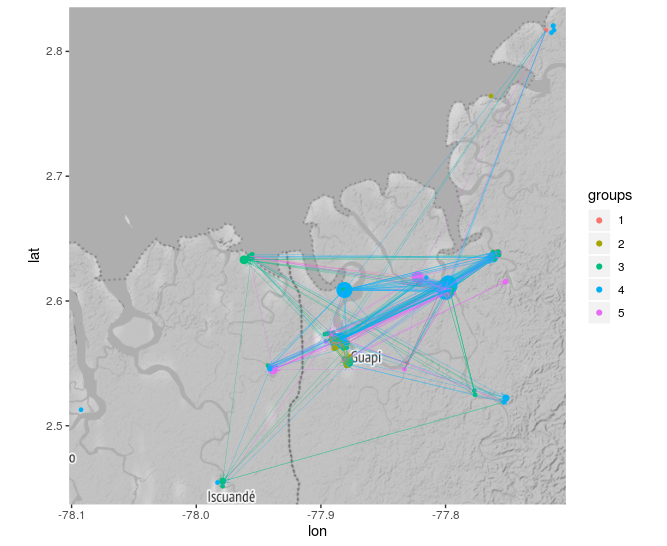

# Example 1: Malaria Data

The following gives an example of mapper and the epidemiology module. The example is made with 137 samples of Plasmodium.

## Loads the Data

```{r }
library('mapperKD')

# Loads the data
meta_df = read.csv('data/data.csv', stringsAsFactors = FALSE)
distance_matrix = read.csv('data/matrix.csv', header = FALSE)
```

## Mapper Graph (One Squeleton)

Excecutes the mapper algorithm with the following parameters
* *Distance Matrix:* distance constructed using Identity by Descent (IBD)
* *Filter Function:* The date of occurence (in the data, this corresponds to the column: day_ocurrence)
* *Number of Intervals*: 20
* *Percentage of Overlap:* 30
* *Clustering Method:* Hierarchical Clustering

```{r }
# Applies the Algorithm
one_squeleton_result = mapperKD(k = 1, # <- Number of dimensions
                                distance = distance_matrix, # <- Distance Matrix
                                filter = meta_df$day_ocurrence, # <- Filter
                                intervals = c(20), # <-number of intervals
                                overlap = c(30), # <- Percentage of overlap
                                clustering_method = function(x){hierarchical_clustering(x,  method = 'single', height = 0.05)})


# Plots the 1 Esqueleton (graph)
plot_1_esqueleton(one_squeleton_result)
```


## Point Intersection Network (PIN)

With the epidemiology module, the PIN can be constructed and ploted directly from the mapper result
```{r }
# Plots the point intersection network
plot_intersection_network(one_squeleton_result, groups = groups, max_node_size = 6)
```


Plots the PIN over the geographical coordinates, focusing on the samples in Colombia

```{r }
# Plot intersection network over colombia
only_colombia =  (1:dim(meta_df)[1])[meta_df$lon < - 70]
plot_intersection_network_over_map(one_squeleton_result, 
                                   lon  = meta_df$lon, 
                                   lat = meta_df$lat, 
                                   groups = groups,
                                   focus_on = only_colombia)
```

